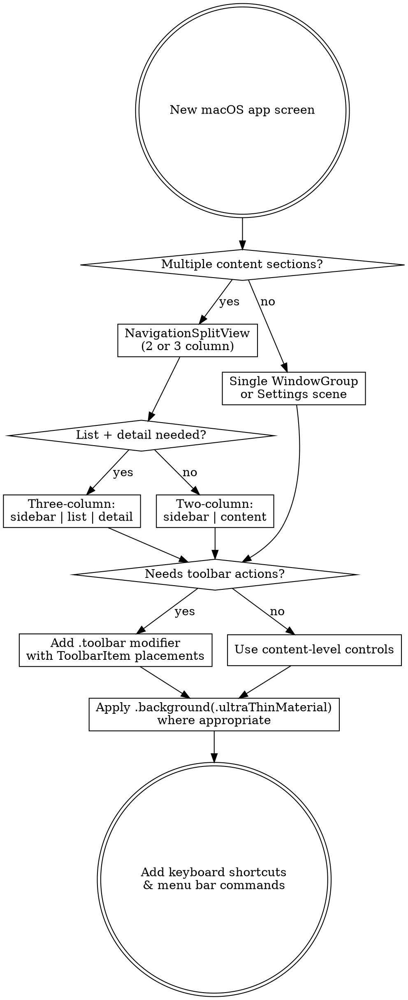

# Designing macOS Apps

## Overview

Design and build interfaces that are **truly native macOS** — leveraging SwiftUI views, AppKit materials, SF Symbols, and system-provided components that automatically adapt to appearance, accessibility, and display scaling. Never fake what the system gives you for free.

**Core principle:** The best macOS apps are invisible infrastructure. Users don't admire the UI — they inhabit it. Design for sustained daily use, not first impressions.

## When to Use

- Building native macOS apps with SwiftUI or AppKit
- Designing UI specifications targeting macOS native development
- Creating Figma/Sketch mockups that must map to real SwiftUI components
- Architecting navigation, layout, and information hierarchy for desktop apps
- Implementing sidebar + list + detail (three-column) patterns
- Adding vibrancy, materials, and system integration

**Not for:** Web apps styled to look like macOS, iOS-first apps, marketing sites

## Design Decision Flow



## The Five Pillars of Native macOS Design

### 1. Layout — NavigationSplitView is King

The three-column layout is the defining pattern of macOS productivity apps (Finder, Mail, Notes, Passwords). SwiftUI gives you this natively.

**Three-column:**

```swift
NavigationSplitView {
    SidebarView()
        .navigationSplitViewColumnWidth(min: 200, ideal: 220, max: 260)
} content: {
    ContentListView()
        .navigationSplitViewColumnWidth(min: 250, ideal: 300, max: 400)
} detail: {
    DetailView()
}
.navigationSplitViewStyle(.balanced)
```

**Column width guidelines:**

| Column       | Min   | Ideal | Max       | Purpose                |
| ------------ | ----- | ----- | --------- | ---------------------- |
| Sidebar      | 180pt | 220pt | 260pt     | Navigation, categories |
| Content list | 250pt | 300pt | 400pt     | Browsable items        |
| Detail       | 400pt | flex  | unlimited | Full content display   |

**Window sizing:**

```swift
WindowGroup {
    ContentView()
}
.defaultSize(width: 900, height: 600)
.windowResizability(.contentMinSize)
```

### 2. Materials & Vibrancy — Let the System Do the Work

macOS vibrancy is a system-level compositing effect. Use the provided materials, never recreate them.

**SwiftUI materials (back to front by thickness):**

```swift
.background(.ultraThinMaterial)  // Sidebars, overlays
.background(.thinMaterial)       // Popovers, secondary panels
.background(.regularMaterial)    // Cards, grouped content
.background(.thickMaterial)      // Elevated surfaces
.background(.ultraThickMaterial) // Highest opacity — rarely needed
```

**Where to apply:**

| Surface   | Material             | Notes                                       |
| --------- | -------------------- | ------------------------------------------- |
| Sidebar   | System default       | `List { }.listStyle(.sidebar)` auto-applies |
| Toolbar   | System-provided      | Never override                              |
| Popovers  | `.thinMaterial`      | Automatic on `.popover()`                   |
| Sheets    | `.regularMaterial`   | Automatic on `.sheet()`                     |
| Inspector | `.ultraThinMaterial` | Use `.inspector()` modifier                 |

**Sidebar vibrancy is automatic:**

```swift
List(selection: $selection) {
    Section("Favorites") {
        ForEach(favorites) { item in
            Label(item.name, systemImage: item.icon)
        }
    }
}
.listStyle(.sidebar)  // This one modifier gives you native sidebar material
```

**NEVER manually recreate vibrancy.** No blur shaders. No opacity hacks. If you're writing blur code, you're fighting the framework.

**Light vs dark material behavior:**
Materials are NOT the same in both appearances. In dark mode, materials darken and blur the wallpaper behind them. In light mode, materials brighten and wash out the wallpaper, creating a frosted-glass effect where the desktop photo bleeds through as soft luminous tints.

```swift
// This single line adapts automatically to both appearances:
.background(.ultraThinMaterial)
// Dark → dark translucent blur
// Light → bright frosted glass with wallpaper color bleed

// For custom surfaces that need to work in both modes:
.background {
    RoundedRectangle(cornerRadius: 10)
        .fill(.regularMaterial)
        // System handles light/dark automatically
}
```

**Sidebar appearance difference:**
In light mode, the sidebar often has a warm, tinted quality from the wallpaper bleeding through (visible in Finder, Music, Spotify). In dark mode it reads as a dark translucent panel. Both come from the same `.listStyle(.sidebar)` — the system compositor handles the difference.

**Window background in light mode:**
Light windows use `Color(.windowBackgroundColor)` which resolves to a warm off-white (#ECECEC), not pure white. The content area is slightly brighter than the sidebar, creating a subtle depth step without explicit dividers.

### 3. Typography — Semantic Styles Only

Never hardcode font sizes. Use semantic text styles that adapt to Dynamic Type and user preferences.

```swift
Text("Window Title")      .font(.largeTitle)     // 26pt bold
Text("Section Header")    .font(.title)          // 22pt bold
Text("Group Title")       .font(.title2)         // 17pt bold
Text("Subheader")         .font(.title3)         // 15pt semibold
Text("Body Content")      .font(.body)           // 13pt regular
Text("Secondary Info")    .font(.callout)        // 12pt regular
Text("Metadata")          .font(.caption)        // 11pt regular
Text("Tiny Label")        .font(.caption2)       // 10pt medium
```

**Text color hierarchy:**

```swift
Text("Primary")    .foregroundStyle(.primary)     // Full opacity
Text("Secondary")  .foregroundStyle(.secondary)   // ~55% opacity
Text("Tertiary")   .foregroundStyle(.tertiary)    // ~35% opacity
Text("Quaternary") .foregroundStyle(.quaternary)   // ~18% opacity
```

**Monospaced for code/data:**

```swift
Text("usepasswall*.!").font(.system(.body, design: .monospaced))
Text("3,627,284").monospacedDigit()  // Tabular figures
```

**NEVER:** `.font(.system(size: 24, weight: .bold))` — always use semantic styles.

### 4. SF Symbols — The Icon System

5,000+ symbols that match San Francisco type weight and optical alignment. Always prefer SF Symbols over custom icons.

**In labels:**

```swift
Label("Logins", systemImage: "lock.fill")
Label("Credit Cards", systemImage: "creditcard")
Label("Private Notes", systemImage: "note.text")
Label("Trash", systemImage: "trash")
```

**Rendering modes:**

```swift
Image(systemName: "heart.fill").symbolRenderingMode(.monochrome)
Image(systemName: "iphone.gen3.circle.fill").symbolRenderingMode(.hierarchical)
Image(systemName: "externaldrive.badge.checkmark").symbolRenderingMode(.multicolor)
Image(systemName: "person.crop.circle.badge.plus")
    .symbolRenderingMode(.palette)
    .foregroundStyle(.white, .green)
```

**Symbol effects (macOS 14+):**

```swift
Image(systemName: "wifi").symbolEffect(.variableColor.iterative)
Image(systemName: "arrow.clockwise").symbolEffect(.rotate, isActive: isLoading)
Image(systemName: "checkmark.circle").symbolEffect(.bounce, value: taskComplete)
```

**Common symbol choices:** See `components-reference.md` for the full SF Symbols lookup table.

### 5. Color — System Semantic Colors

Use Apple's semantic color system. It handles dark mode, high contrast, and accessibility automatically.

```swift
// Backgrounds — auto-adapt
.background(Color(.windowBackgroundColor))
.background(Color(.controlBackgroundColor))
.background(Color(.underPageBackgroundColor))

// User's accent color preference
.tint(.accentColor)

// System accent palette
Color.blue    Color.green    Color.red
Color.orange  Color.yellow   Color.purple
Color.pink    Color.teal

// Separators
Color(.separatorColor)
Color(.gridColor)

// Label hierarchy (matches .foregroundStyle)
Color(.labelColor)              // Primary
Color(.secondaryLabelColor)     // Secondary
Color(.tertiaryLabelColor)      // Tertiary
Color(.quaternaryLabelColor)    // Disabled
```

**NEVER hardcode colors:** `Color(hex: "#333")` is a dark mode bug, a high contrast bug, and an accessibility bug.

## 6. Appearance — Light & Dark Done Right

macOS apps must work in both appearances. The system gives you this for free IF you use semantic APIs — but you need to understand the visual differences to design effective layouts.

### How Appearances Differ

| Aspect            | Light Mode                                                           | Dark Mode                                              |
| ----------------- | -------------------------------------------------------------------- | ------------------------------------------------------ |
| **Window chrome** | Warm off-white (#ECECEC)                                             | Near-black with translucency                           |
| **Sidebar**       | Frosted glass, wallpaper tints bleed through as warm luminous washes | Dark translucent panel, wallpaper shows as muted color |
| **Content area**  | Bright white/near-white, slightly brighter than sidebar              | Dark gray, slightly lighter than sidebar               |
| **Depth cues**    | Subtle shadows + brightness difference                               | Brightness difference + border highlights              |
| **Separators**    | Light gray dividers, more visible                                    | Ultra-subtle white-alpha dividers                      |
| **Text**          | Dark on light (high contrast by default)                             | Light on dark (slightly reduced contrast)              |
| **Accent colors** | Slightly darker/saturated variants                                   | Slightly brighter/lighter variants                     |
| **Vibrancy**      | Brightens wallpaper behind — frosted glass                           | Darkens wallpaper behind — smoked glass                |
| **Shadows**       | Visible, define elevation                                            | Minimal, borders define elevation instead              |

### Design for Both, Test in Both

```swift
// NEVER branch on colorScheme for standard UI
// ❌ This is almost always wrong:
@Environment(\.colorScheme) var colorScheme
Color(colorScheme == .dark ? "#1a1a1a" : "#f5f5f5")

// ✅ This adapts automatically:
Color(.windowBackgroundColor)
.foregroundStyle(.secondary)
.background(.regularMaterial)
```

**When colorScheme branching IS legitimate:**

- Custom artwork/illustrations that need inverted variants
- Brand-colored surfaces where the system palette doesn't apply
- Chart/graph colors that need contrast adjustments per appearance

```swift
// Legitimate use: adapting a brand accent overlay
@Environment(\.colorScheme) var colorScheme

.overlay {
    brandGradient
        .opacity(colorScheme == .dark ? 0.15 : 0.08)
}
```

### Asset Catalogs for Appearance

For images and custom colors that need per-appearance variants:

```swift
// In Assets.xcassets, define "Any Appearance" + "Dark" variants
// Then reference them normally — system picks the right one:
Image("artist-header")  // Provides light & dark variants automatically
Color("BrandSurface")   // Resolves to light or dark defined color
```

### The Light Mode Checklist

Light mode is the default macOS appearance. Many developers build dark-first and break light. Always verify:

- [ ] Sidebar has visible depth separation from content (brightness step, not border)
- [ ] Text meets WCAG contrast ratios against light backgrounds
- [ ] Custom accent surfaces (colored cards, badges) remain readable
- [ ] Shadows are present and define card/popover elevation
- [ ] `.separatorColor` dividers are visible but not heavy
- [ ] Selected rows have sufficient tint against white background
- [ ] Toolbar icons have enough weight (`.fontWeight(.medium)` on symbol images)
- [ ] Empty states and placeholder text are visible, not washed out

### The Dark Mode Checklist

- [ ] No pure black (#000) backgrounds — macOS dark mode is dark gray, not OLED black
- [ ] Cards and elevated surfaces are lighter than their background (reverse of light mode)
- [ ] Borders/outlines provide elevation cues where shadows disappear
- [ ] Accent colors are the brighter dark-mode variants (system does this for `Color.blue` etc.)
- [ ] Vibrancy materials allow wallpaper to show through appropriately
- [ ] Hover states are visible (white-alpha highlights, not shadow-based)

## Persistent Bottom Bar (Now Playing / Status Bar)

Many macOS apps have a persistent bar anchored to the bottom of the window — music players (now playing), IDEs (status bar), chat apps (input bar). This is NOT a toolbar — it's a custom view pinned below the main content.

```swift
struct ContentView: View {
    var body: some View {
        VStack(spacing: 0) {
            // Main content (NavigationSplitView, etc.)
            NavigationSplitView {
                SidebarView()
            } content: {
                ListView()
            } detail: {
                DetailView()
            }

            // Persistent bottom bar
            NowPlayingBar()
        }
    }
}
```

See `components-reference.md` for the full `NowPlayingBar` and `StatusBar` implementations.

## Quick Reference: SwiftUI ↔ macOS Mapping

| What You Want           | SwiftUI API                       | Don't Do                      |
| ----------------------- | --------------------------------- | ----------------------------- |
| **Three-column layout** | `NavigationSplitView`             | Manual `HSplitView`           |
| **Sidebar**             | `List { }.listStyle(.sidebar)`    | Custom `VStack`               |
| **Search**              | `.searchable(text:prompt:)`       | Custom `TextField`            |
| **Vibrancy**            | `.background(.ultraThinMaterial)` | Custom blur shaders           |
| **Toolbar**             | `.toolbar { ToolbarItem }`        | Custom `HStack` at top        |
| **Icons**               | `Image(systemName:)`              | Custom SVG/PNG                |
| **Text sizing**         | `.font(.body)`                    | `.font(.system(size: 13))`    |
| **Colors**              | `.foregroundStyle(.secondary)`    | `Color(hex:)`                 |
| **Dark mode**           | Automatic with semantic colors    | Manual colorScheme switching  |
| **Light mode**          | Same code, test both appearances  | Separate light/dark codepaths |
| **Appearance colors**   | Asset catalog with Any/Dark       | Hardcoded hex per mode        |
| **Bottom bar**          | `VStack { content; bar }`         | Overlay or toolbar hack       |
| **Context menu**        | `.contextMenu { }`                | Custom right-click            |
| **Keyboard**            | `.keyboardShortcut()`             | Manual NSEvent                |
| **Settings**            | `Settings { }` scene              | Custom window                 |
| **Menu bar**            | `MenuBarExtra { }`                | Manual NSStatusItem           |

## Common Mistakes

**Building what the system provides** — If you're writing more than 5 lines for search, toolbar, context menus, or sidebar styling, stop. SwiftUI has it.

**Hardcoding colors and sizes** — Every hardcoded value is a dark mode bug, a Dynamic Type bug, and an accessibility bug.

**Custom blur/vibrancy** — System materials composite at the window-server level. You cannot replicate this with shaders.

**iOS patterns on macOS** — No tab bars, no full-screen sheets, no hamburger menus, no pull-to-refresh. macOS uses sidebars, toolbars, and menu bar commands.

**Oversized touch targets** — macOS uses a pointer. Buttons are 22-28pt tall, not 44pt. List rows use 6-8pt padding, not 12-16pt.

**Missing keyboard shortcuts** — Every action needs a menu bar command with a shortcut via `.commands` on `WindowGroup`.

**Dark-only design** — Light mode is the macOS default. If you only test dark mode, your sidebar loses depth, your text loses contrast, and your accent colors wash out. Always test both.

**Pure black in dark mode** — macOS dark mode uses dark grays (#1E1E1E to #2D2D2D), never pure #000000. Pure black kills vibrancy and makes elevated surfaces indistinguishable.

**Branching on colorScheme for standard UI** — If you're writing `if colorScheme == .dark` for backgrounds, text colors, or separators, you're doing it wrong. Semantic colors handle this.

## App Architecture Template

```swift
@main
struct MyApp: App {
    var body: some Scene {
        WindowGroup {
            ContentView()
        }
        .defaultSize(width: 960, height: 640)
        .commands { AppCommands() }

        Settings { SettingsView() }

        MenuBarExtra("MyApp", systemImage: "lock.shield") {
            MenuBarView()
        }
        .menuBarExtraStyle(.window)
    }
}

struct ContentView: View {
    @State private var selectedCategory: Category?
    @State private var selectedItem: Item?
    @State private var searchText = ""

    var body: some View {
        NavigationSplitView {
            SidebarView(selection: $selectedCategory)
        } content: {
            ItemListView(category: selectedCategory, selection: $selectedItem)
        } detail: {
            if let item = selectedItem {
                ItemDetailView(item: item)
            } else {
                ContentUnavailableView(
                    "No Selection",
                    systemImage: "doc.text.magnifyingglass",
                    description: Text("Select an item to view details")
                )
            }
        }
        .searchable(text: $searchText, prompt: "Search")
    }
}
```

## Platform Integration Checklist

- [ ] Menu bar commands with standard keyboard shortcuts (⌘N, ⌘F, ⌘,)
- [ ] Settings scene with `.formStyle(.grouped)`
- [ ] Full keyboard navigation (Tab, arrows, Enter, Escape)
- [ ] Drag and drop (`.draggable()` / `.dropDestination()`)
- [ ] `.searchable` for any list or collection
- [ ] `ContentUnavailableView` for empty states
- [ ] `.confirmationDialog` for destructive actions
- [ ] Window title and minimum size set
- [ ] **Light mode tested** — sidebar depth, text contrast, shadows, selection visibility
- [ ] **Dark mode tested** — vibrancy, elevated surfaces, border cues, hover states
- [ ] Both tested with multiple wallpapers (vibrancy tint varies with wallpaper)
- [ ] Increased Contrast accessibility setting tested
- [ ] Menu bar extra if app runs in background
